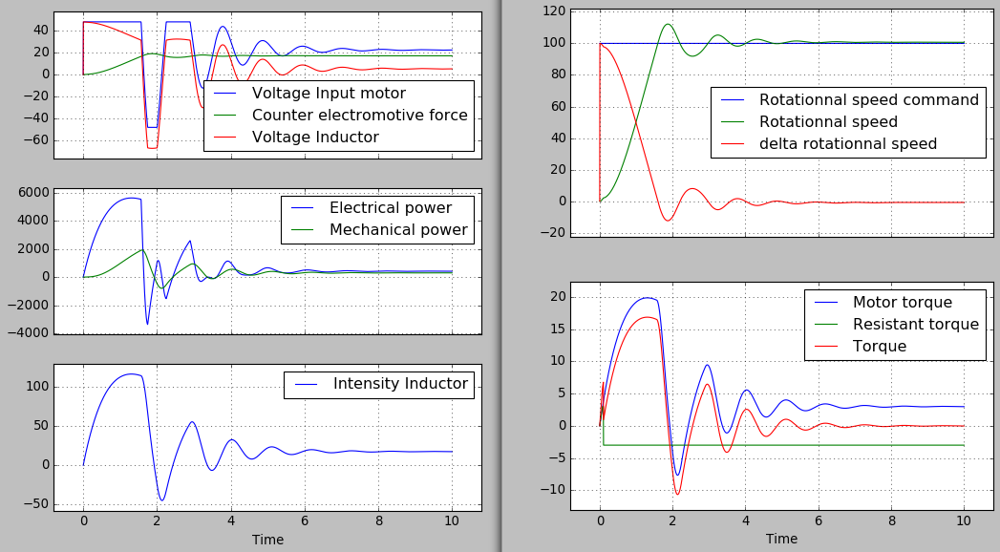

Getting Started
===============

What is BMS for?
----------------

BMS stands for "Block Model Simulator". It helps defining a DynamicalSystem, a collection of variables linked by equations or behaviors.

The values of the model's variables are computed by the model and can be displayed or post-treated.

Here is for example the output of an electric motor model:

Installation
------------

The easy way: 

.. code::

  pip install bms

or, if you are running python3:

.. code::

  pip3 install bms

Alternatively, you can download the source at: https://pypi.python.org/pypi/bms/ After extracting, execute: 

.. code::

  python setup.py install 

If you are running python3: 

.. code::

  python3 setup.py install

